<!--
 * @Author: JC 407981034@qq.com
 * @Date: 2023-08-04 11:51:50
 * @LastEditors: JC 407981034@qq.com
 * @LastEditTime: 2023-08-07 17:35:43
 * @FilePath: \Notes\Computer\Hardware.md
 * @Description: 这是关于计算机硬件和网络的一些知识，将会为后续Linux打基础
-->
[TOC]

---

# 计算机基础

## · 计算机分类

1. 超级计算机
2. 工控计算机
3. 网络计算机（无硬盘）
4. 个人计算机（PC）
5. 嵌入式计算机

## · 计算机发展史

【这些都是电路控制开关的进步发展史】
1. 继电器数字机
1. 电子管数字机（1946-1958）
2. 晶体管数字机（1958-1964）
   - 第一台全晶体管计算机由IBM研发
   - 晶体管开始研发半导体，促进硅谷诞生
   - 以晶体管组成逻辑门
3. 集成电路数字机（1964-1970）
4. 大规模集成电路机（1970- ？）

---
1. 算盘
2. 步进计算机
3. 差分机（太先进没造出来，后续一个历史学家造出来了）
4. 自动计算机（没造出来）
5. 美国人口普查-打孔制表机（后续发展成IBM）
## · 计算机信息处理

1. 十进制表示信息
2. 状态太多影响信息准确性
3. 以布尔代数为基础建立二进制机制
   - 布尔代数中不进行数值计算，只进行逻辑操作
   - 逻辑操作包含`NOT`、`OR`、`AND`、`XOR`四种逻辑操作，同时电路包含了这四种晶体管组成的逻辑门
   - `NOT`是一个晶体管控制
   - `OR`是两个晶体管并联（只需要打开一个）
   - `AND`是两个晶体管串联（两个都要打开）
   - `XOR`由`AND`、`OR`、`NOT`共同实现

4. 二进制表示数据
   - 整数：首为为正负，其余位为有效数值
   - 浮点数：首为为正负，接着8位存二进制指数，其余位为有效数值
   - 字母/文字：
      - ASCII编码：0-255（2^8-1），为英语设计
      - UTF-8编码：对Unicode字符集的二进制实现，万国码
## · 冯.诺依曼计算机体系

1. 计算机硬件：存储器、运算器、控制器、输入设备、输出设备
2. 采用二进制表示数据和指令
3. 程序预先放在主存中，方便计算机自动高速从存储器中取出指令并执行
---
# 计算机硬件

## · CPU（中央处理器）

### CPU概述
1. CPU是中央高速处理器，属于高速设备
2. 故障原因：温度过高（天气、散热器、长时间高负荷运行、超频）
3. 参考指标：主频、缓存、核数

【超过主频为超频，更高速更易损坏】

> Intel（LGA铜片触点式接口）
> 酷睿：i3、i5、i7、i9

> AMD（PGA针脚接口）
> 锐龙：R3、R5、R7、R9

### CPU组件
#### ①运算单元：ALU（算术逻辑单元）、FPU（浮点运算单元）
1. ALU：包含一个算术单元和逻辑单元
2. 算术单元：负责计算机所有数字操作
   - 加法器：半加器、全加器以及其底层电路原理，复合实现行波进位加法器
   - 超前进位加法器：加法器进位延迟，现代计算机多用超前进位加法器
   - 减法同理，乘除以加减法进行运算，手机、笔记本可能集成有乘法的算术单元
3. 逻辑单元：负责逻辑门运算

#### ②存储单元：寄存器、cache（SRAM的一种）

1. AND-OR锁存器：具有设置和复位功能，能存储一位数据
2. 门锁：设置一些逻辑门，实现对锁存器的输入和提取
   - 一根线数据输出
   - 一根线是否允许写入
   - 一根线数据输入
3. 寄存器：多个锁存器集成
   - 位宽：能一次存储数据的位数，64位计算机即寄存器位宽64位
   - 寄存器中集成锁存器以矩阵的方式减少连线，并统一使用一根数据输出、允许写入线、允许读取线（也可以没这根）
   - 矩阵需要精确地址：以行和列组成地址，使用两个多路复用器开启某一个锁存器（一个row，一个column）
   - 寄存器的位宽与内存相关联，32位只能支持不到4G内存，64位支持128G内存
   - 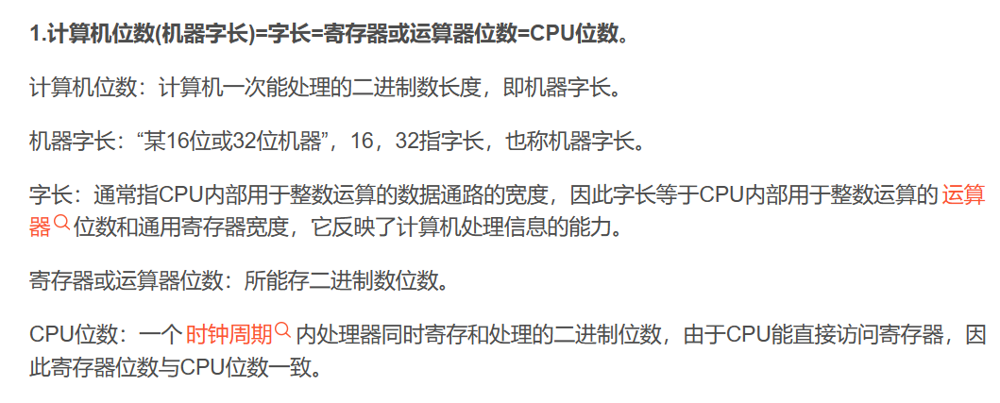

#### ③控制单元

## · 硬盘（磁盘）

1. HDD机械硬盘（价格低、速度慢、容量大、技术稳定）
2. SSD固态硬盘（价格贵、速度快、容量小）
    1. sata固态
    2. m.2固态（nvme接口、sata接口，nvme更快）
    3. pci-e固态
3. 接口：IDE、SCSI、SATA、SAS
   
    ###### （SATA和SAS是主流，SAS速度更快）
4. 参考指标：容量、缓存、读写速度（转速）

## · 内存

### 内存概述

1. 内存最小单元256位存储，集成锁存器以矩阵的方式减少连线，并统一使用一根数据输出、允许写入线、允许读取线（也可以没这根）
2. 矩阵需要精确地址：以行和列组成地址，使用两个多路复用器开启某一个锁存器（一个row，一个column）
3. 8个最小单元共同控制地址，相同地址组成8位数据，则共256Byte数据

> GPU ⇆ 内存 ⇆ 硬盘
> 【CPU <------>寄存器 <---->缓存<----->内存】
> GPU要处理存储器中的数据需要将数据提出
> 但因为GPU是高速设备，硬盘是低速设备
> 所以GPU和硬盘会用缓存，并以内存实现中间交换

1. 计算机将系统常用数据加载到内存，方便GPU直接提取数据进行读写
2. 参考指标：容量（根据生产力选择）、频率（兼容问题）

### 内存原理

#### ①RAM：随机存取存储器

1. SRAM：静态，不断刷新保持数据
2. DRAM：动态，断电就失去数据
3. SRAM具有可以随时访问任意位置的性质

#### ②Flash
#### ③NVRAM
## · 主板

1. 主板好坏直接决定计算机速度的快慢和运行稳定
2. 主要电路系统：BIOS芯片、I/O控制芯片、键和面板控制开关接口、扩充插槽等
3. 一般集成了网卡、声卡，部分集成了显卡
4. 参考指标：CPU平台、接口数量、支持的技术

## · 显卡（图像输出设备）

1. 接口：ISA、PCI、AGP、PCI-E
2. 参考指标：显存、位宽、频率

---
# 计算机网络概述

## · 计网
计算机网络是由**通信介质**将不同地理位置的独立计算机连接起来，实现数据和资源共享

## · 网络分类

### 网络拓扑分类
1. 总线型
> **一般传输介质为同轴电缆，需要T型头（结点）和信号终结器（两端）**
> 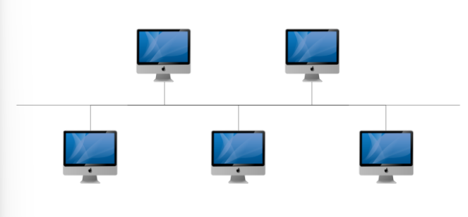

2. 环形
> **需要申请令牌才可以通信（即同一时间只能有两台设备联络）**
> 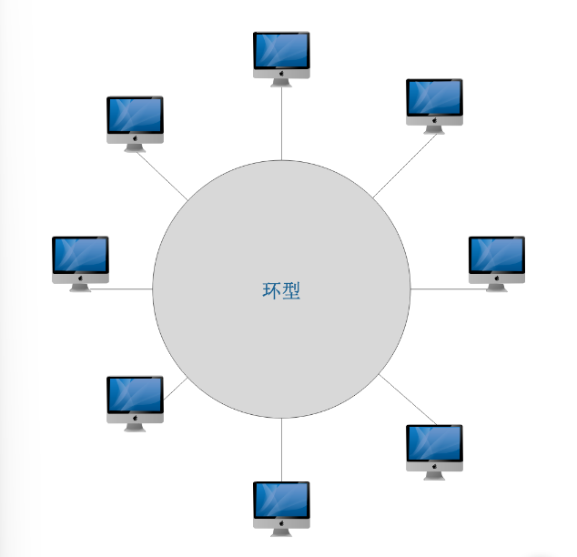

3. 星型
> **中央节点压力大，单点故障，线路冗余**
> 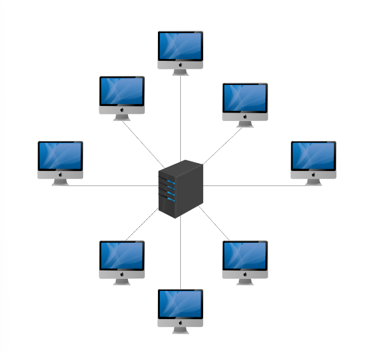

4. 网型
> **效率高，网络复杂，目前使用最多**
> 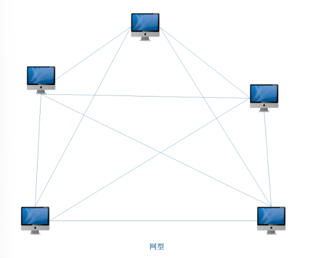

### 地域分类
1. 局域网（LAN）：一个公司、一个家庭
2. 城域网（MAN）：一个区、一个城市、一个国家
3. 广域网（WAN）：一个国家、全世界

## · 网络设备
1. **switch交换机** 一个电脑数据交给另一个电脑：
负责组建局域网，研究的是MAC地址（厂商网卡48位2进制地址，交换机连接网卡和计算机）
2. **router路由器** 一个网络数据交给另一个网络：
负责将局域网与局域网连接起来组建广域网，研究的是IP地址

---

# OSI七层网络模型

## 概论

【为解决不同厂商计算机之间无法通信的问题，最终ANSI提交给ISO这份DSA七层结构作为OSI七层网络模型】

1. ISO：国际标准化组织，成立于1946
2. DSA：分布式系统体系结构
3. OSI：开放系统互连
4. ANSI：美国国家标准协会

## OSI网络模型（了解）
【建议从**应用层**往**物理层**逆序查看】

> **1. 物理层 （网卡、网线、集线器、中继器、调制解调器）**
> · 维护、建立、断开电信号的物理连接
> · 由底层网络定义协议，在四层模型中与数据链路层合并

> **2. 数据链路层 （网桥、交换机）**
> · 以MAC地址和插线接口对应进行物理寻址，将电信号变为逻辑传输线路
> · 将比特组合成字节再进行组合成帧，用MAC地址访问介质，错误发现但不能更正
> · 由底层网络定义协议，在四层模型中与物理层合并

> **3. 网络层 （路由器）**
> · 控制子网运行，进行逻辑地址寻址，实现不同网络之间的路径选择
> · 协议有：ICMP、IGMP、IP（IPV4 IPV6）、ARP、RARP

> **4. 传输层**
> · 接受下一层的数据，必要时进行数据分割并传入网络层，保证数据段达到对端
> · 定义传输数据的协议端口号，以及流控和差错校验
> · 协议有：TCP、UDP，数据包一旦离开网卡则进入网络传输层
> · 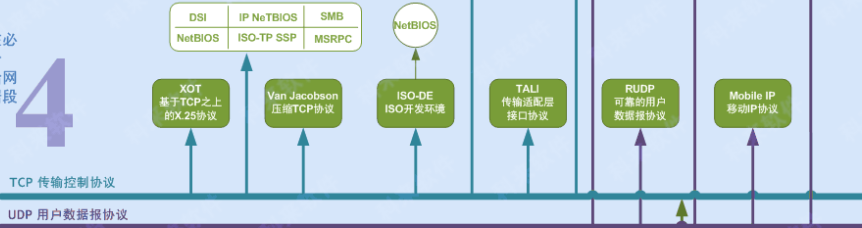

> **5. 会话层**
> · 不同机器上的用户之间建立、管理、终止会话
> · 对应主机进程，即本地主机与远程主机正在进行的会话
> · 在四层模型中合并到了应用层

> **6. 表示层**
> · 信息的语法语义以及它们的关联，及对数据进行表示、安全、压缩等操作
> · 即加密解密、压缩解压缩、转换翻译
> · 在四层模型中合并到了应用层

> **7. 应用层**
> · 各种应用程序协议，是网络服务和最终用户的一个接口
> · 协议有HTTP、HTTPS、POP3等一系列
> · 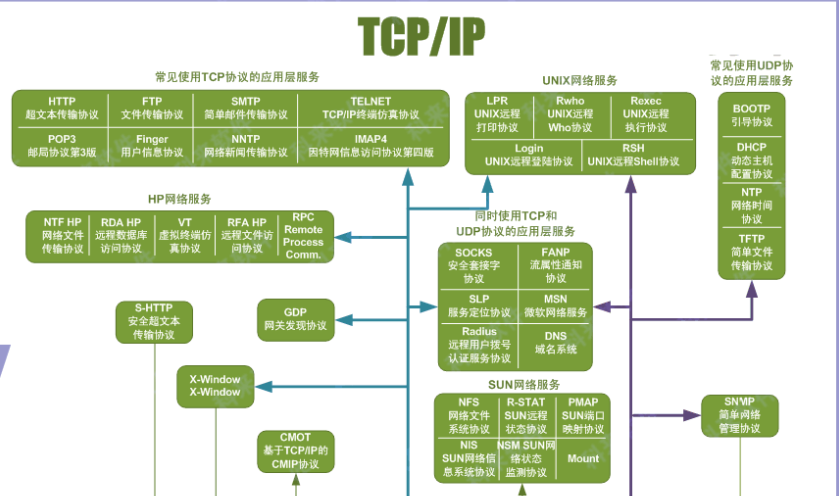

> **自己的总结**
> 1. 物理层实现电信号接收
> 2. 数据链路层将电信号组合成帧，并以接口-MAC地址，进行物理寻址
> 3. 网络层以接口-IP地址，进行广域网的网络寻址
> 4. 传输层两大协议：TCP安全但慢，UDP不安全但快
> 5. 会话层建立用户对话
> 6. 表示层进行加密/解密，压缩/解压
> 7. 用户接口，网络和用户进行交互

## 特点

1. OSI七层过于严格，并未应用在计算机中
2. 使用其衍生的TCP/IP四层模型

---

# TCP/IP四层网络模型
## TCP/IP模型
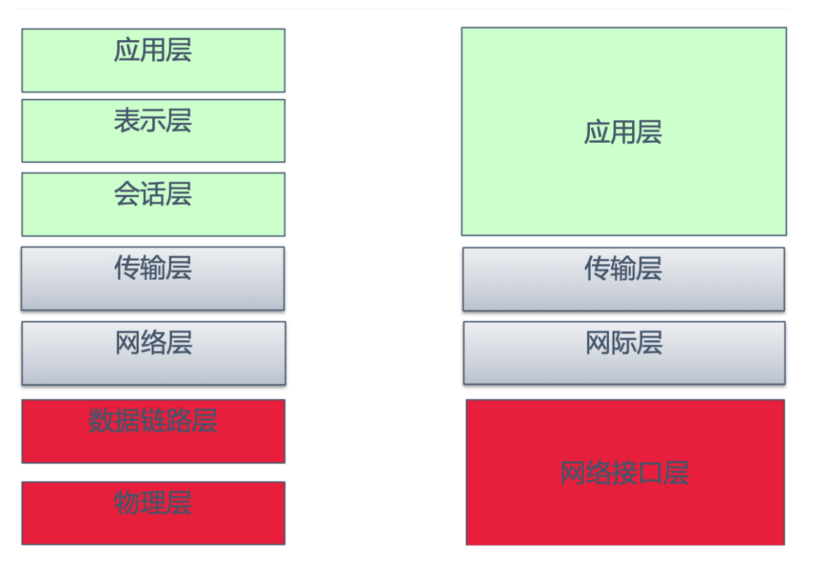

1. **网络接口层**：包括操作系统中的**设备驱动程序**和计算机中对应的**网络接口卡**，物理链路寻址，接口-MAC地址。
   · ARP协议（IP->MAC），RARP协议（MAC->IP）

2. **网际层**：有时也称作互联网层，逻辑链路寻址，接口-IP地址。 
   · IP协议，ICMP协议，IGMP协议

3. **传输层**：主要为两台主机上的应用程序提供端到端的通信。
   · TCP协议，UDP协议

> TCP：通过一系列机制，为用户提供安全可靠的慢传输
> UDP：为用户提供不可靠的快速传输，安全性由应用层提供
> 两种协议各有优劣，根据应用层决定不同选择

4. **应用层**：负责处理特定的应用程序细节。几乎各种不同的 TCP/IP实现都会提供下面这些通用的应用程序:
    1. Telnet 远程登录。
    2. FTP 文件传输协议。
    3. SMTP 简单邮件传送协议。
    4. SNMP 简单网络管理协议。

## 协议簇和通信

### · TCP/IP协议簇
> 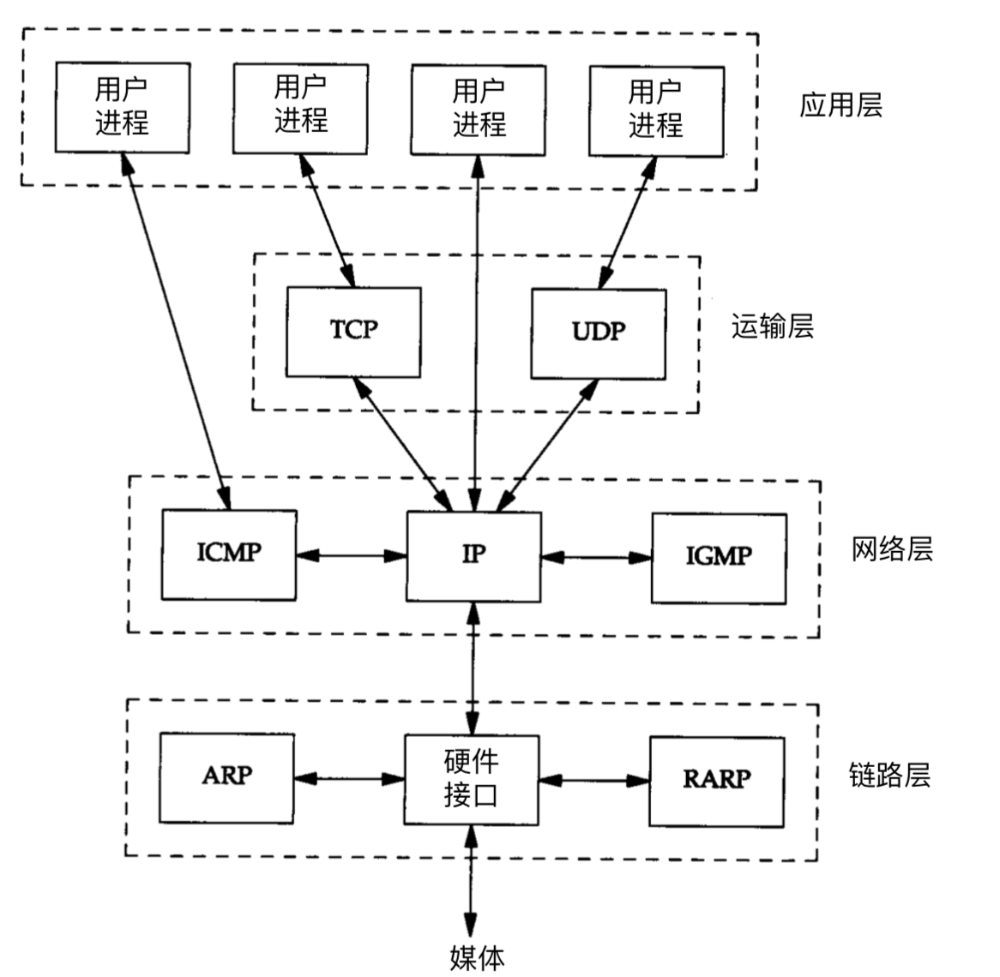

### · C/S通信（客户端/服务器）
> 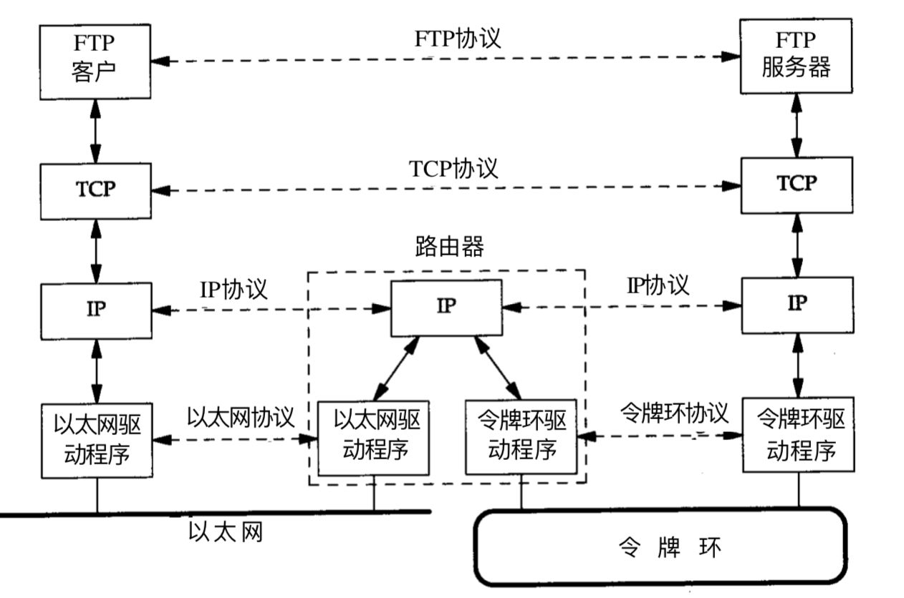
> 以太网：一种局域网通信的技术标准

##  传输层协议（经典中的经典）

### · TCP协议

1. TCP：面向连接的协议（彼此交换数据前先建立一个连接）
2. 连接的建立：三次握手
   连接的断开：四次断开
3. 一对一传输
4. 三次握手
> 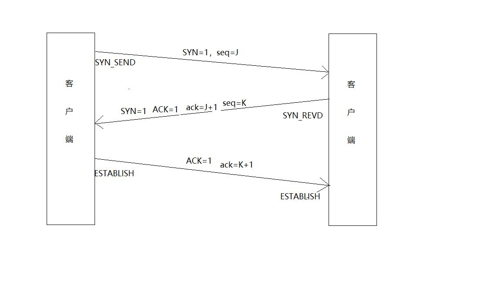
> ① 客户端A请求连接
> ② 客户端B回应，协商传输窗口和机制
> ③ 客户端A确认并建立连接

5. 建立连接后：
   · 窗口机制（一次传几个数据包）
   · 确认重传机制（一个包没收到会持续发送直到确认收到）
6. 四次断开
> 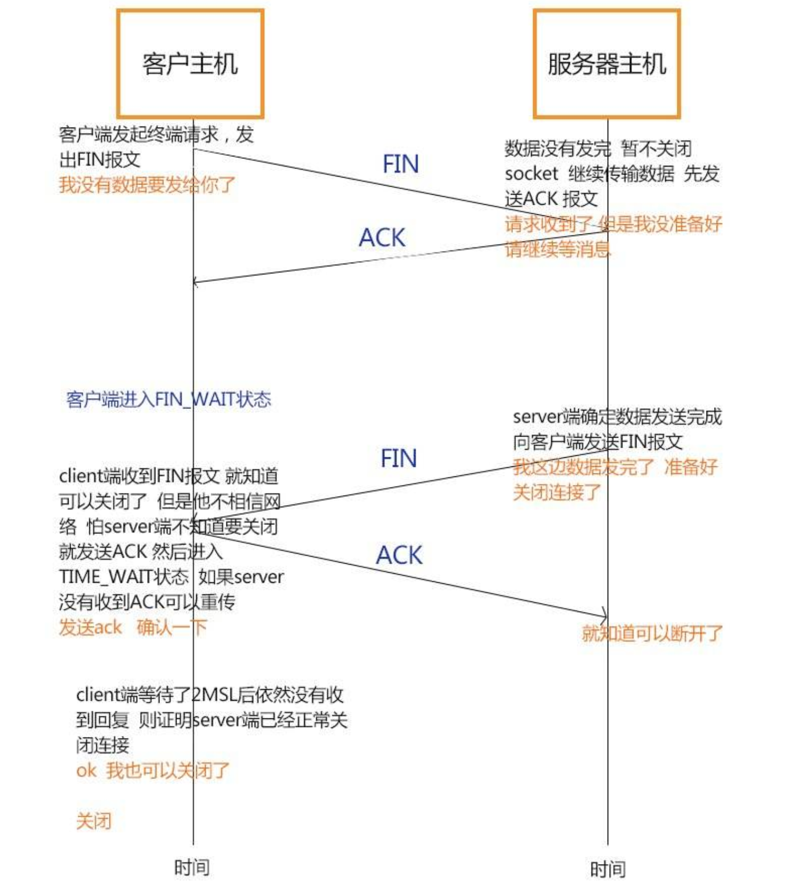
> ① 客户端申请断开，服务端收到并继续发送数据包
> ② 服务器发送完毕，同意断开
> ③ 客户端收到并同意断开
> ④ 服务器收到并断开
> 服务器断开2MSL时间后客户端未收到数据自动断开

### · UDP协议

1. UDP：用户数据报协议，面向事务的**简单不可靠**传送服务
2. UDP提供了无连接通信，不建立连接只管发不管收没收到
3. 适合于一次传输少量数据,没有可靠性保证、顺序保证和流量控制字段等，可靠性较差
4. UDP可以一对多、一对一、多对一、多对多的交互通信

### · TCP和UDP区别

1. - TCP面向连接，建立联系之前需要建立连接
   - UDP是无连接的，即发送数据之前不需要建立连接

2. - 通过TCP连接传送的数据，无差错，不丢失，不重复，且按序到达
   - UDP不保证可靠交付

3. UDP具有较好的实时性，工作效率比TCP高，适用于对高速传输和实时性有较高的通信或广播通信。

4. - 每一条TCP连接只能是点到点的
    - UDP支持一对一，一对多，多对一和多对多的交互通信

5. - TCP对系统资源要求较多
    - UDP对系统资源要求较少。

---
# IP协议

## · 概述

1. IP（因特网协议）：网络之间互联的协议，即为计算机网络互联通信设计的协议
2. IP地址：互联网协议地址，是IP协议提供的统一逻辑地址格式，以实现互联网互通
3. MAC地址：网卡出厂时厂商规定的硬件地址
4. IP地址分类：IPV4,IPV6

## · 两者异同

1. IPV4共**32位**，IPV6共**128位**（**4倍**）
2. IPV4分**4段**，IPV6分**8段**（**2倍**）
3. IPV4每段最大**2^8 -1**，IPV6每段最大**2^16 -1**（**2倍**）
4. IPV4常用**十进制**，IPV6常用**十六进制**（**4位**十六进制）
5. IPV4每段最大**255**，IPV6每段最大**FFFF**

## · IPV4

### IPV4的规范
1. 分为4段十进制数（其实也可以用二进制或十六进制）`a.b.c.d`，**以点分隔** 
2. 32位划分4组，每组8位，每组最大不超过255（十进制，2的8次方-1）
### 地址分类
1. IPV4按照第一段的范围进行分类
> A 1-126       大量网络节点（超大型网络）
> B 128-191     介于AC之间的中型网络
> C 192-223     少量网络节点（超小型网络）
> D 224-239     多播地址
> E 240-255     保留地址，用于研究

1. 五类地址中只有ABC三类可使用
2. 网络类型决定了IP地址如何划分为网络部分和节点部分（子网掩码）

### 子网掩码
1. 子网掩码：区分IP地址的网络位和主机位（掩码是对IP的说明）
> A 255.0.0.0（网.主.主.主）
> B 255.255.0.0
> C 255.255.255.0
> D 255.255.255.255

2. 网络位：掩码的二进制全为1的组是网络位
3. 主机位：不全为1的组是主机位
4. 所有网络位加一起为网络地址，主机地址亦然
5. 拥有相同网络地址的计算机属于同一网段

### 私网地址
1. IPV4实现私网重复使用，除了私网地址以外的公网地址都是唯一地址不可重复使用
> A: 10.0.0.0 -- 10.255.255.255
> B: 172.16.0.0 -- 172.31.255.255
> C: 192.168.0.0 -- 192.168.255.255

2. 局域网中使用私网IP，减少公网占用
3. 私网地址免费且不能上网，公网地址花钱租用
4. 不可上网的私网IP用路由器上的**PNAT技术**实现地址转换达到可以上网

### PNAT技术
1. 局域网中用私网IP，不可联网，要访问广域网需要用PNAT实现地址转换技术
2. 由网关（路由）配置PNAT技术，在网关进行用公网IP进行替换，以达到上网的目的
3. 一个局域网的所有私网IP都可以共用一个公网IP进行上网
> 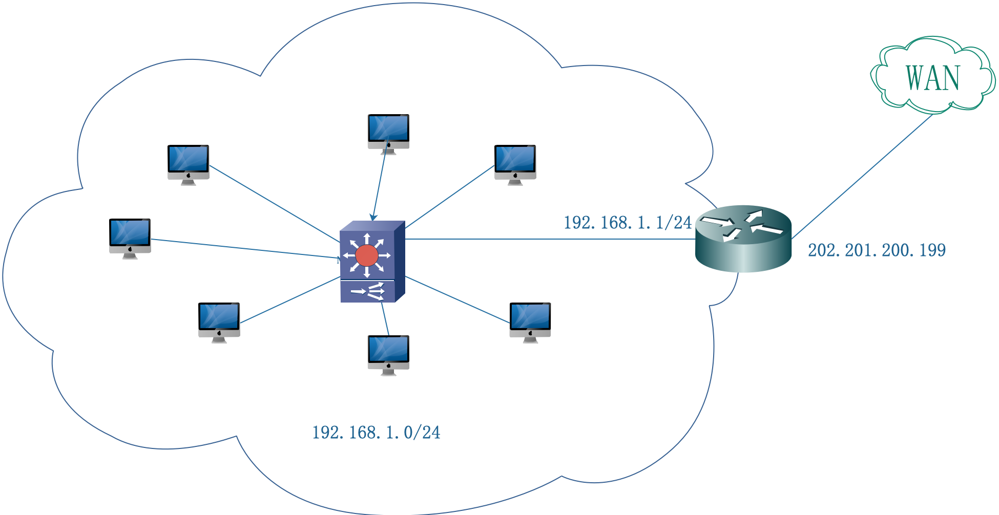
> 在不同局域网中可使用相同的私网IP，互不干涉矛盾
### IP分配原则
1. **只有ABC三类**可分配给计算机和网络
2. 同一网段的**主机地址必须唯一**
3. 网络地址首段数字不能为**127**，用来保留测试链接，回拨地址
4. 网络地址和主机地址的**二进制IP**不能全为0，也不能全为1
5. 主机地址全为0表示网络地址，全为1用作广播

> **IPV4特殊不能使用的IP**
> 0.0.0.0
> 255.255.255.255
> 127.x.x.x
> A.0.0.0 、 A.255.255.255
> 169.254.0.0 - 168.254.255.255
> (计算机自动获取该网段，方便本地联网通信)

> 1. 网络号全0：当前子网的主机
> 2. 127网段：回拨地址
> 3. 二进制全1地址：本地子网的广播
> 4. 主机号全1：特定子网的广播
> 5. 169.254.0.0：Win系统保留地址，自动获取网段，用于DHCP失效
> 6. 0.0.0.0：Linux系统保留地址，自动获取网段，用于DHCP失效
## · IPV6

### IPV6的规范
1. 分为8段十六进制数`a:b:c:d:e:f:g:h`，每段最大**冒号分隔**
2. 长度为128位，是IPV4地址的4倍，常采用16进制表示，每段最大为FFFF（十进制的65535，2的16次方-1）
3. 解决IPV4不够用的问题
4. 0位压缩
5. IPV6向下内嵌IPV4，如::192.168.0.1，前置位压缩0，IPV6共32位，占IPV6的两段

### 地址分类

1. 单播地址（Unicast Address）：一对一
    - **可聚合的全球单播地址**
  ：**2000开头**，相当于公网IPV4
    - **链路本地地址**
  ：**FE80开头**，相当于169.254网段进行本地局域网通信
    - **站点本地地址**
  ：**FEC0开头**，相当于私网IPV4
    - **未指定地址**
  ：**全0地址**，相当于IPV4全0地址，主机源地址
    - **回环地址**
  ：**以1结尾**，相当于127网段，回环地址
    - **唯一的本地单播地址**
1. 组播地址（Multicast Address）：一对多
2. 任播地址（Anycast Address）：一对最近

### IPV6特殊地址
> 1. **::** 全0地址，相当于IPV4全0地址，用作主机的源地址【不可分配给计算机】
> 2. **::1** 相当于IPV4的127网段，回环地址【不可分配给计算机】
> 3. **2000::** 公网地址
> 5. **FEC0开头** 私网地址
> 6. **FE80** 本地局域网通信

### IPV6更新换代

1. IPV4地址黑白名单需要时间重新在IPV6上建立，避免网络威胁
2. 骨干线路实现更新换代，IPV6随着物联网而更新换代
3. 设备更新

## VLSM

1. 掩码：通过对IP地址类别划分，用掩码表示IP地址的网络位和主机位
2. 192.168.1.0/26 表示网络位26位，原本网络位该24位，借了2位，即划分成了2^2个子网，剩下的主机位除开全1全0剩下的为有效主机位
3. VLSM（可变长子网掩码）：对子网再进行子网划分，使IP地址得到最充分的利用，即减少其他无用机位占用的网络带宽
   - 避免固定长度子网浪费地址空间
   - 提高带宽利用率
   - 实现LAN中的网络隔离，更加安全
4. 借了n位，则划分为2^n个子网，子网之间相差借的最低位的权值
> 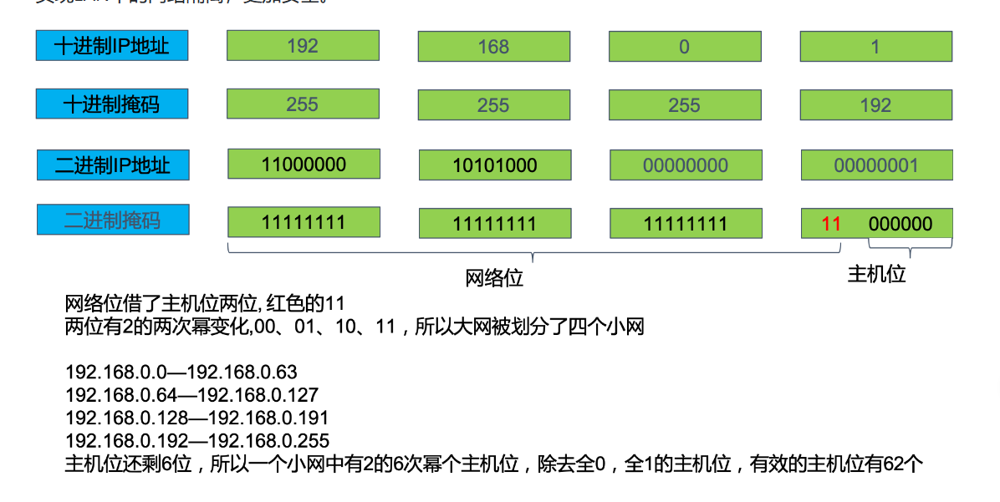